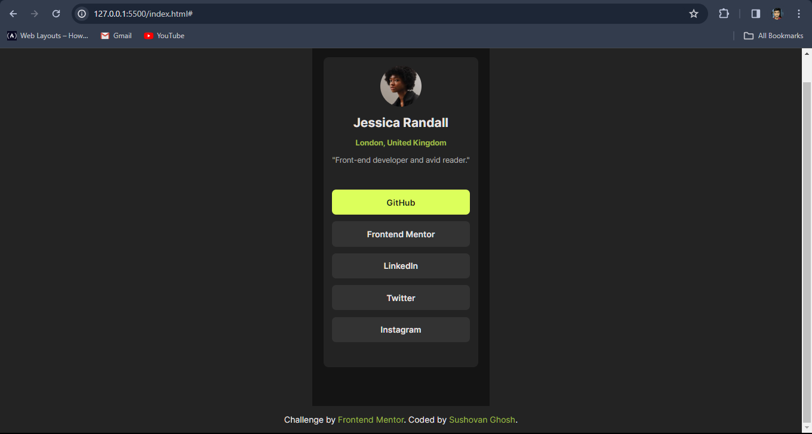

# Frontend Mentor - Social links profile


# Solution

This is a solution to the [Social links profile challenge on Frontend Mentor](https://www.frontendmentor.io/challenges/social-links-profile-UG32l9m6dQ). Frontend Mentor challenges help you improve your coding skills by building realistic projects. 

## Table of contents

- [Overview](#overview)
  - [The challenge](#the-challenge)
  - [Screenshot](#screenshot)
  - [Links](#links)
- [My process](#my-process)
  - [Built with](#built-with)
  - [What I learned](#what-i-learned)
- [Author](#author)

## Overview

### The challenge

Users should be able to:

- See hover and focus states for all interactive elements on the page

### Screenshot



### Links

- Solution URL: [Add solution URL here](https://your-solution-url.com)
- Live Site URL: [Add live site URL here](https://your-live-site-url.com)

## My process

### Built with

- Semantic HTML5 markup
- CSS custom properties
- Flexbox
- Mobile-first workflow

### What I learned

- Using flexbox is lot easier to add gap between elements than using margin property.

To see how you can add code snippets, see below:

```css
.links li:not(:last-child) {
    margin-bottom: 0.8rem;
}
```
## Author

- Frontend Mentor - [@Ghosh-95](https://www.frontendmentor.io/profile/Ghosh-95)
- GitHub - [@Ghosh-95](#https://github.com/Ghosh-95)
